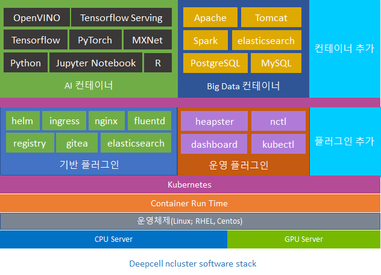

  한국어 |
  <a href="README_EN.md">English</a>

---

# 딥셀-엔클러스터

딥셀 엔클러스터는 스타셀이 개발하고 있으며 스타셀은 관련된 하드웨어와 여러가지 자원들에 대한 지원을 제공하고 있습니다.

딥셀 엔클러스터는 어렵고 복잡한 컨테이너 클러스터를 한 번에 구축할 수 있는 솔루션입니다. 딥셀 엔클러스터를 이용하면 한 번의 설치로 쿠버네티스 기반의 컨테이너 클러스터를 구축하고 컨테이너 어플리케이션을 운영하고 배포하는데 필요한 플러그인들을 즉시 사용할 수 있습니다. 딥셀 엔클러스터를 이용하여 컨테이너 클러스터를 구축하고 나면 다음과 같은 일들을 할 수 있습니다.

* 빅데이터 시스템을 위한 서버 시스템 구축 : RDBMS, Elasticsearch, Spark 등
* 다중 사용자(Multi User)를 위한 딥러닝 시스템 구축 : Python, Jupyter Notebook, Tensorflow, PyTorch, OpenVINO 등
* 웹서비스를 위한 서버 시스템 구축 : Apache Webserver, Apache Tomcat, Nginx, Node.js 등
* 그 외에 기타 다수의 서버를 필요로 하는 개발 또는 운영환경

또한 딥셀 엔클러스터는 GPU를 사용하는 딥러닝 프레임워크를 지원합니다.
다음은 현재 딥셀 엔클러스터가 지원하는 딥러닝 프레임워크입니다.

* Tensorflow/CPU : Batch, Jupyter Notebook  
* Tensorflw/GPU : Batch, Jupyter Notebook  
* PyTorch/CPU : Batch, Jupyter Notebook(지원예정)  
* PyTorch/GPU : Batch, Jupyter Notebook(지원예정)  
* Horovod를 이용한 분산 딥러닝  
* TensorBoard  
* Tensorflow Serving  
* OpenVINO OpenVINO Model Server  

# 딥셀 엔클러스터 문서

[딥셀 엔클러스터 문서](docs/ncluster/README.md)가 준비 중입니다. 

# License

By contributing to the project software, you agree that your contributions will be licensed under the Apache 2.0 license that is included in the LICENSE file in the root directory of this source tree.
The user materials are licensed under [CC-BY-ND 4.0](https://creativecommons.org/licenses/by-nd/4.0/legalcode).

# Contact

Submit Github issue to ask a question, submit a request or report a bug.
