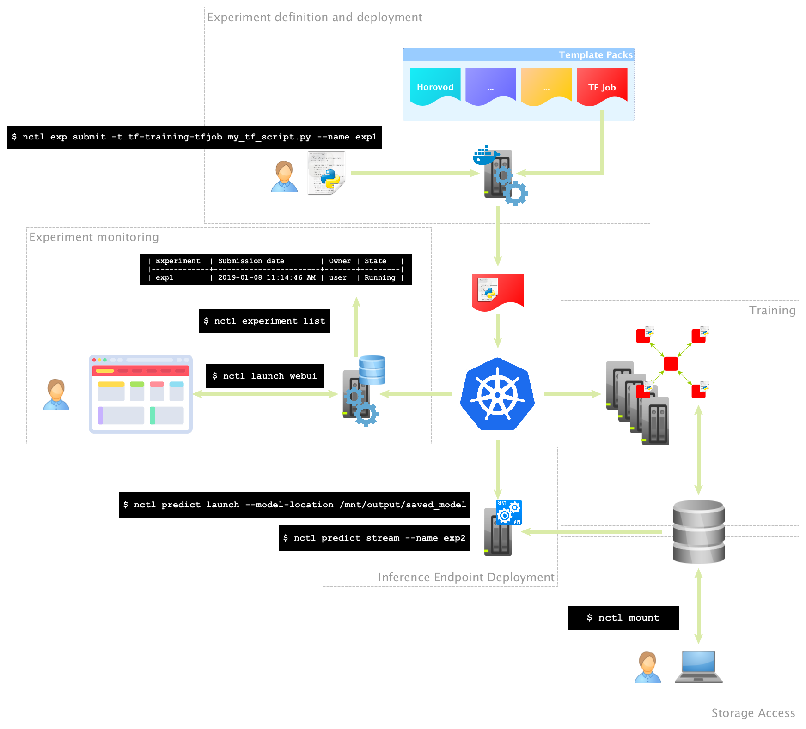

# 딥셀-엔클러스터

딥셀 엔클러스터는 스타셀이 개발하고 있으며 스타셀은 관련된 하드웨어와 여러가지 자원들에 대한 지원을 제공하고 있습니다.

  한국어 |
  <a href="README_EN.md">English</a>

우선 나우타 문서를 참고 하세요. : https://intelai.github.io/nauta/

딥셀 엔클러스터는 쿠버네티스 클러스터 구축을 위한 패키지 소프트웨어입니다. 딥셀 엔클러스터는 인텔의 나우타(Nauta)를 포크하여 시작하였습니다. 나우타는 딥러닝 모델 트레이닝을 위한 다중 사용자용 분산 컴퓨팅 환경을 지원하는 쿠버네티스 클러스터 구축용 패키지입니다. 그러나 인텔에서 더 이상 나우타를 지원하지 않기로 하였습니다. 그래서 스타셀에서 이를 포크하여 딥셀 엔클러스터 프로젝트를 시작하게 되었습니다. 딥셀 엔클러스터는 딥러닝용 컴퓨팅 환경 뿐 아니라 일반 서비스, 특히 마이크로 서비스를 위한 쿠버네티스 클러스터를 구축하는 데도 유용한 클러스터 구축용 소프트웨어로서 개발하고자 합니다. 또한 딥셀 엔클러스터는 GPU를 사용하는 딥러닝 프레임워크를 지원합니다.
다음은 현재 딥셀 엔클러스터가 지원하는 기능들입니다.

* Tensorflow/CPU : Batch, Jupyter Notebook  
* Tensorflw/GPU : Batch, Jupyter Notebook  
* PyTorch/CPU : Batch, Jupyter Notebook(지원예정)  
* PyTorch/GPU : Batch, Jupyter Notebook(지원예정)  
* Horovod를 이용한 분산 딥러닝  
* TensorBoard  
* Tensorflow Serving  
* OpenVINO OpenVINO Model Server  

현재 GPU를 지원하는 기능이 추가된 상태이며 다른 기능은 나우타와 동일합니다. 나우타에 없는 기능이나 다른 기능에 대한 문서를 먼저 작성하여 공개하고 있습니다. 나우타 기능은 당분간 나우타 문서를 참고 하시기 바랍니다.

# 딥셀 엔클러스터에서 추가된 내용
딥셀 엔클러스터에서 추가된 내용은 [딥셀 엔클러스터 문서](docs/ncluster/README.md)에 따로 정리되어 있습니다.

# 나우타 문서

To build Nauta installation package and run it smoothly on Google Cloud Platform please follow our [Nauta on Google Cloud Platform - Getting Started](toolbox/providers/gcp/gcp.md). More details on building Nauta artifacts can be found in [How to Build](docs/installation-and-configuration/How_to_Build_Nauta/HBN.md) guide.

To get things up and running quickly please take a look at our [Getting Started](docs/user-guide/actions/getting_started.md) guide.

For more in-depth information please refer to the following documents:

- [Nauta Installation and configuration guide](docs/installation-and-configuration/) 
- [Nauta User Guide](docs/user-guide/README.md)

# License

By contributing to the project software, you agree that your contributions will be licensed under the Apache 2.0 license that is included in the LICENSE file in the root directory of this source tree.
The user materials are licensed under [CC-BY-ND 4.0](https://creativecommons.org/licenses/by-nd/4.0/legalcode).

# Contact

Submit Github issue to ask a question, submit a request or report a bug.
